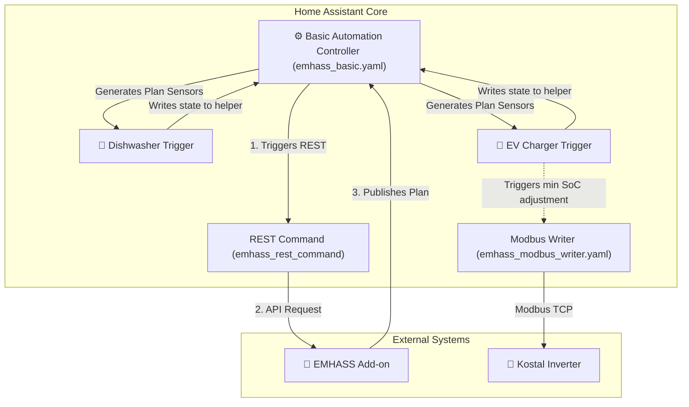

# Project Structure

This document describes the directory structure of the Home Assistant and EMHASS automation project, detailing the roles of the blueprints, dashboards, examples, and test infrastructure, as well as their interactions.

## Directory Layout

```
Home-Assistant/
├── .editorconfig          # Editor formatting rules
├── .gitignore             # Git ignored files and directories
├── README.md              # Public repository documentation
├── emhass_config.json     # EMHASS add-on config values
├── prompt.txt             # Project history and development notes
│
├── blueprints/            # Home Assistant Blueprints
│   └── automation/
│       ├── README.md                              # Documentation for Blueprints module
│       ├── emhass_basic.yaml                     # Central EMHASS controller (the "brain")
│       ├── emhass_basic_trigger.yaml             # Generic deferrable load controller
│       ├── emhass_basic_trigger_go_echarger.yaml  # Specialized wallbox load controller
│       ├── emhass_modbus_writer.yaml             # Modbus registers writer
│       └── room_control.yaml                     # Climate and shutter room automation
│
├── dashboards/            # Lovelace Dashboards
│   ├── README.md          # Documentation for Dashboards module
│   ├── kiosk.yaml         # Main responsive tablet/mobile dashboard
│   └── uebersicht.yaml    # General system overview dashboard
│
├── examples/              # Blueprints examples and helper entities
│   ├── README.md          # Documentation for Examples module
│   ├── automation/        # Initial automation concepts (e.g. database purge)
│   ├── blueprints/        # Yaml instantiations of the blueprints
│   └── sensors/           # Template helpers and virtual sensors
│
└── tests/                 # Local test infrastructure (python-based)
    ├── Dockerfile         # Python environment for running tests
    ├── run_tests.ps1      # PowerShell runner script using Docker
    ├── ha_mock.py         # Mock environment for Home Assistant Jinja2 rendering
    ├── test_*.py          # Pytest files (dishwasher, wallbox, etc.)
    ├── mocks/             # Baseline entity states and config definitions
    └── scenarios/         # Data-driven JSON test cases for testing transitions
```

---

## Component Interaction

The system operates as a centralized Hub-and-Spoke model optimized for energy management:



1. **EMHASS Basic Automation Controller (`emhass_basic.yaml`)**:
   - Acts as the central "brain." It is the **only** blueprint allowed to make API calls to the EMHASS add-on.
   - It reads the configurations of all active loads from their respective `input_text` JSON helpers, constructs a unified payload, and executes optimization runs.
   - It schedules periodic publish/optimization intervals (e.g. 5 minutes) and ML forecast tuning/training (daily).

2. **Deferrable Load Controllers (`emhass_basic_trigger.yaml` & `emhass_basic_trigger_go_echarger.yaml`)**:
   - Act as "satellites." Each deferrable load (dishwasher, wallbox, water heater) has its own automation instance.
   - They maintain their status (`done`, `wait`, `running`, `force`) and output a standardized JSON state in an `input_text` helper, which the basic controller picks up.
   - They react to the optimized schedule sensors (`sensor.p_deferrableX` created by EMHASS) to switch physical devices on/off.

3. **Modbus Writer (`emhass_modbus_writer.yaml`)**:
   - Writes directly to inverter Modbus registers (e.g. Kostal Plenticore) to set parameters like minimum battery State of Charge (`scb_battery_min_soc`) when grid charges or wallbox charges are active.

4. **Testing Infrastructure (`tests/`)**:
   - Uses data-driven JSON test cases under `scenarios/` combined with a custom Jinja2 interpreter in `ha_mock.py` to evaluate blueprint conditions and verify target status variables without requiring a running Home Assistant instance.
