# EMHASS Blueprint Control Suite

This repository provides a set of Home Assistant Blueprints designed to simplify the configuration and control of the **EMHASS** (Energy Management Optimization for Home Assistant) add-on.

> [!IMPORTANT]
> __Please note__ _that this code is provided by me as a private individual and is not an official product. This project is offered on an **"AS IS"** basis, without warranty of any kind, express or implied. I cannot guarantee that this code will function as intended on your system. Adaptations and customizations for your specific environment may be necessary. I am in no way affiliated with the official **EMHASS** project or its developers. By using this code, you agree that you are doing so **entirely at your own risk**. The author assumes no liability for any potential damages, data loss, or other issues that may arise from its use._

[![BuyMeCoffee][buymecoffeebadge]][buymecoffee] [![PayPal][paypalbadge]][paypal]

This project is built around two core blueprints that work together:

1. **EMHASS Basic Automation Controller**: The central "brain." This blueprint manages all core EMHASS settings, timers, and API communication.
2. **EMHASS Deferrable Load Controller**: The "satellite." You create one automation from this blueprint for each deferrable load (e.g., dishwasher, EV charger) you want EMHASS to control.

Everything in the `main` branch is in use on my personal system. The `develop` branch is my testing ground, but feel free to explore it.

## Architecture Overview

```mermaid
graph TD
    subgraph Home Assistant Control
        HA["🏠 Home Assistant Core"]
        BASIC["⚙️ Basic Automation Controller"]
        LOAD_C["🔌 Deferrable Load Controller(s)"]
    end

    EMHASS["🧠 EMHASS Add-on"]

    subgraph Deferrable Loads
        DW["🧺 Dishwasher"]
        WH["💧 Water Heater"]
        BAT["🔋 Battery Storage"]
    end

    HA --> BASIC
    BASIC -- Calls API --> EMHASS
    EMHASS -- Writes optimized plan to HA --> HA

    LOAD_C -- Controls --> DW
    LOAD_C -- Controls --> WH
    LOAD_C -- Controls --> BAT

    LOAD_C -- Requests needed power --> BASIC

    BASIC -.- EMHASS

    style EMHASS fill:#00AA00,stroke:#333,stroke-width:2px,color:#fff
    style LOAD_C fill:#ffc,stroke:#333
```


## Features
- **Centralized Configuration**: Manage all EMHASS parameters from a single automation in the HA UI.
- **Dynamic Deferrable Loads**: Easily add or remove deferrable loads by simply adding their input_text helper.
- **Automated Control**: Manages all EMHASS timers for saving configs, running optimizations, publishing data, and training ML models.
- **Clear State Management**: The Deferrable Load Controller provides robust, strategy-based logic to manage the state (wait, running, done) of your devices.

## Support
Please understand that I can only provide support for my own blueprints and their functionality. I cannot provide general support for the **Energy Management Optimization for Home Assistant (EMHASS)** add-on itself.

If you have questions about EMHASS, please refer to the [official EMHASS documentation](https://emhass.readthedocs.io/) or its community forums. **Tip**: Always check the EMHASS add-on logs for errors!

## Found a Bug or Missing a Feature?
Please open an issue on my GitHub repository

## Terminology
- **HA**: Home Assistant
- **EMHASS**: Energy Management Optimization for Home Assistant
- **Deferrable Loads**: Devices that are managed by EMHASS, which decides the optimal time to turn them on.

## Installation & Setup Guide

### Prerequisites
Before you begin, you must have the following installed and configured:
1. **Home Assistant Core**: Your basic HA configuration.yaml must include:
    - `latitude`
    - `longitude`
    - `unit_system: metric`
    - `time_zone: Europe/Berlin` (or your local timezone)
2. **EMHASS Add-on**: Install the [EMHASS Addon](https://github.com/davidusb-geek/emhass).
    - In the add-on configuration, set:
        - `Set folder path where EMHASS data will be stored` -> `/share`
        - `The port opened by the add-on on your host` -> `5000`
    - (See [Image](./images/EMHASS_Addon_Config.png) for a visual guide)
3. **Required Sensors**: EMHASS needs several sensors to function. You must provide:
    - A PV Forecast sensor (I use [Solcast](https://github.com/BJReplay/ha-solcast-solar)).
    - A Battery SOC sensor (if you have a battery, i get this from my [Kostal](https://www.home-assistant.io/integrations/kostal_plenticore/) integration).
    - A PV Power sensor (in W) (I get this from my [Kostal](https://www.home-assistant.io/integrations/kostal_plenticore/) integration).
    - A Base Load sensor (in W). This is your total house consumption minus all deferrable loads. (See my example [sensor](./examples/sensors/emhass_config_home_power_no_var_loads.yaml) config).

### Step 1: Configure Home Assistant (REST Command)
For the blueprints to communicate with the EMHASS add-on, you must add the following `rest_command` to your HA `configuration.yaml`:
```
rest_command:
  emhass_rest_command:
    url: '{{ protocol }}://{{ host }}:{{ port }}/{{ api }}'
    timeout: 59
    method: POST
    content_type: 'application/json'
    payload: '{{ payload }}'
```

### Step 2: Create Initial Helpers
Before installing the blueprints, you must create two HA Helpers (Go to **Settings > Devices & Services > Helpers**).
These will be used for your first deferrable load, but they are required to save the Basic Controller automation.
1. **Input Text**:
    - Name: (e.g., `Dishwasher EMHASS JSON`)
    - Max Length: 255
    - Initial value: `{"po":500,"ho":0.5,"st":0,"et":6,"se":false,"si":true,"mp":200,"pe":0,"us":"done","ss":0}`
        - po = Nominal Load Power (W)
        - ho = Total Operating Hours (h)
        - st = Initial Start Timestep
        - et = Final End Timestep
        - se = Semi-Continuous Load (Bool)
        - si = Single Constant Block (Bool)
        - mp = Minimum Load Power (W)
        - pe = Startup Penalty Score
        - us = Status
        - ss = Plan start timestamp
2. **Input Select**:
    - Name: (e.g., `Dishwasher EMHASS Status`)
    - Options:
        - `done`
        - `wait`
        - `running`
        - `force`
    - Ensure the initial state is set to `done`.

### Step 3: Install the 'EMHASS Basic Automation Controller'
This is the main controller.

[](https://my.home-assistant.io/redirect/blueprint_import/?blueprint_url=https%3A%2F%2Fgithub.com%2FDanielBY27%2FHome-Assistant%2Fblob%2Fmain%2Fblueprints%2Fautomation%2Femhass_basic.yaml)

1. Click the "Import Blueprint" button above.
2. Create a new automation from the blueprint.
3. Fill out all required sections. If you are unsure, leave the default settings and only fill in the blank fields. [(You can find my configuration)](./examples/blueprints/emhass_basic_blueprint.yaml).
    - **EMHASS Deferrable Loads Configuration**: Add the `input_text` helper you created in Step 2.
    - EMHASS Runtime Overwrites
    - EMHASS Connection Settings (IP, Port and APIs)
    - EMHASS Global Configuration
    - EMHASS System Configuration
    - EMHASS Tariff Configuration
    - EMHASS Solar System Configuration
    - EMHASS Battery Configuration
4. **IMPORTANT**: In the **Timer Settings** section, leave all timers **DISABLED** for now.
5. Save the automation.

### Step 4: Activate & Test the Basic Controller
This one-by-one activation process is critical for debugging. **Check the EMHASS add-on logs after each step**.
1. **Enable Save-Config Timer (daily)**:
    - Edit your new automation.
    - Go to "Timer Settings," enable this timer, and set the time to 5 minutes from now.
    - Save the automation.
    - Go to the EMHASS add-on and watch the logs. At the specified time, it should save the config without any errors.
2. **Enable Publish & Optimization Timer (5 min interval)**:
    - Enable this timer and save.
    - Check the logs again. You should see no errors, and the log should eventually show that a sensor for your first load has been created: `Successfully posted to sensor.p_deferrable0 = 0.0`.
3. **Enable ML Forecast Timer (daily)**:
    - **Only** enable this if your "Base Load" sensor has at least 9 days of history (per the EMHASS defaults).
    - You must also set the "load_forecast_method" in the "EMHASS System Configuration" section to `mlforecaster`.
    - Enable the timer, set a time, and save. Check the logs at that time for any errors.

### Step 5: Install the 'EMHASS Deferrable Load Controller'
Once the Basic Controller is running without errors, you can install your first load controller.

[](https://my.home-assistant.io/redirect/blueprint_import/?blueprint_url=https%3A//raw.githubusercontent.com/DanielBY27/Home-Assistant/refs/heads/main/blueprints/automation/emhass_basic_trigger.yaml)

1. Import the blueprint using the button above.
2. Create a new automation.
3. Configure all the inputs. This blueprint links your physical device (like a switch) to the HA helpers and the EMHASS sensor.
    - **Status Helper**: Select the `input_select` you created in Step 2.
    - **EMHASS JSON Helper**: Select the `input_text` you created in Step 2.
    - **EMHASS Deferrable Sensor**: Select `sensor.p_deferrable0` (this was created by EMHASS / Basic Controller).
    - ...fill out the rest of the settings according to your device's needs (power, runtime, control entity, etc.).
4. Save the automation.

Your first load is now fully managed by EMHASS!

### Step 6: Add More Loads
To add more devices (e.g., a washing machine, EV charger):
1. Create a new pair of `input_text` and `input_select` helpers for the new device.
2. Go to your **EMHASS Basic Automation Controller** and add the new input_text helper to the "List of Deferrable Load Helpers."
3. Save the Basic Controller automation.
4. Run the "Save-Config Timer".
5. Run the "Enable Publish & Optimization Timer".
6. Create another automation using the **EMHASS Deferrable Load Controller** blueprint, filling in the details for the new device. (This will watch `sensor.p_deferrable1`, `sensor.p_deferrable2`, etc.)
7. Save the Load Controller automation.

### Manual Control (Forcing a Load)
Sometimes you can't wait for the EMHASS optimization (e.g., you need the dishwasher to run now). This is why the `force` status exists.

You can manually start any load by:

1. Going to **Settings > Devices & Services > Helpers**
2. Finding the `input_select` helper for your load (e.g., `input_select.dishwasher_emhass_status)
3. Changing its state from `wait` directly to `force`

The `EMHASS Deferrable Load Controller` automation will detect this change and immediately start the device.

**Dashboard Tip**: You can create a button on your dashboard that calls the `input_select.select_option` service to set the status to `force` for a user-friendly "Start Now" button.
```
type: entity
show_name: true
show_state: true
show_icon: true
entity: input_select.dishwasher_emhass_status
name: Geschirrspüler
icon: mdi:dishwasher
tap_action:
  action: perform-action
  perform_action: input_select.select_option
  target:
    entity_id: input_select.dishwasher_emhass_status
  data:
    option: force
visibility:
  - condition: state
    entity: input_select.dishwasher_emhass_status
    state: wait
color: yellow
```

### Basic Controller Examples
You can find my complete automation configurations here:

- Dishwasher
    - [Configuration](./examples/blueprints/emhass_basic_trigger_dishwasher.yaml)
    - Start Trigger Sensor is my Zigbee device
    - Stop Trigger is a 10-minute statistic sensor for this Zigbee device
- Tumble Dryer
    - [Configuration](./examples/blueprints/emhass_basic_trigger_tumble_dryer.yaml)
    - Start Trigger Sensor is my Zigbee device
    - Stop Trigger is a 10-minute statistic sensor for this Zigbee device
- Washing Machine
    - [Configuration](./examples/blueprints/emhass_basic_trigger_washing_machine.yaml)
    - Start Trigger Sensor is my Zigbee device
    - Stop Trigger is a 10-minute statistic sensor for this Zigbee device
- PV Battery
    - [Configuration](./examples/blueprints/emhass_basic_trigger_pv_battery.yaml)
    - Start Trigger Cron
    - Stop Trigger EMHASS or [sensor](./examples/sensors/emhass_pv_battery_load_from_grid_in.yaml)
    - To charge my BYD battery with my Kostal inverter via the grid, I need another blueprint to enable charging via Modbus

        [](https://my.home-assistant.io/redirect/blueprint_import/?blueprint_url=https%3A//raw.githubusercontent.com/DanielBY27/Home-Assistant/refs/heads/main/blueprints/automation/emhass_modbus_writer.yaml)

        - [Configuration](./examples/blueprints/emhass_modbuss_writer_pv_battery.yaml)
        - Start and Stop Trigger the Status from the main Basic Controller "PV Battery"
- Water Boiler (only for PV surplus)
    - [Configuration](./examples/blueprints/emhass_basic_trigger_water_boiler.yaml)
    - Start and Stop Trigger are my Battery SoC Sensor from the Kostel integration

### Modified controllers
All modified controllers build upon the BASIC controller, then have additional inputs and actions.

---
[](https://my.home-assistant.io/redirect/blueprint_import/?blueprint_url=https%3A//raw.githubusercontent.com/DanielBY27/Home-Assistant/refs/heads/main/blueprints/automation/emhass_basic_trigger_go_echarger.yaml)

- go-e Charger 11kW (Wallbox)
    - [Controller](./blueprints/automation/emhass_basic_trigger_go_echarger.yaml)
    - [Configuration](./examples/blueprints/emhass_basic_trigger_go_echarger_blueprint.yaml)
    - [Trigger Sensor](./examples/sensors/emhass_go-echarger_trigger.yaml)

### Other Blueprints

---
[](https://my.home-assistant.io/redirect/blueprint_import/?blueprint_url=https%3A//raw.githubusercontent.com/DanielBY27/Home-Assistant/refs/heads/main/blueprints/automation/room_control.yaml)

- **Room Control**: Comprehensive room control automation that manages heating and roller shutters based on presence, window status, and sun position.


### References

- https://emhass.readthedocs.io/


[buymecoffee]: https://www.buymeacoffee.com/danielby27
[buymecoffeebadge]: https://img.shields.io/badge/buy%20me%20a-coffee-blue.svg?style=for-the-badge&logo=buymeacoffee&logoColor=ccc

[paypal]: https://paypal.me/DanielBladeck
[paypalbadge]: https://img.shields.io/badge/paypal-me-blue.svg?style=for-the-badge&logo=paypal&logoColor=ccc
